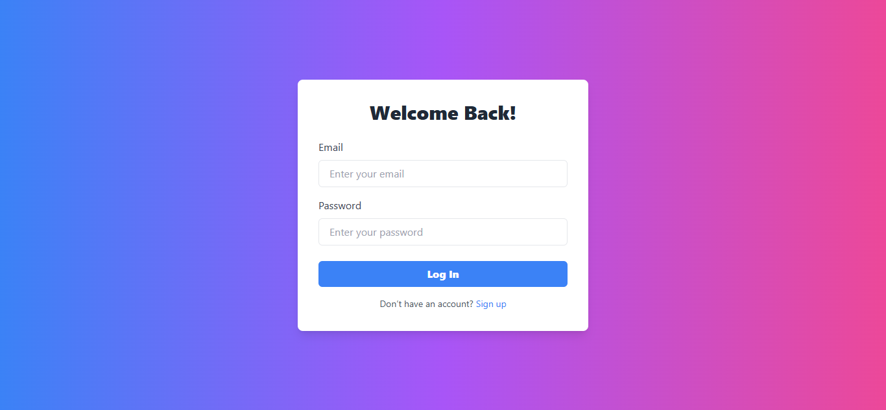
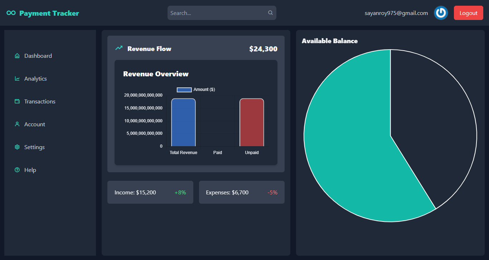

# Invoice and Payment Tracker

## Overview

The **Invoice and Payment Tracker** is a web-based React application designed to help small businesses and freelancers efficiently manage their invoices and payments. With this tool, users can create, send, and track invoices while maintaining customer information and monitoring payment statuses, all within a streamlined and user-friendly interface.

---

# Deployed Link : https://renewable-revolution-015.netlify.app/

---

## Features

### 1. User Authentication
- Secure login and registration system.
- Manage sessions with options to log out.

### 2. Invoice Management
- Create, edit, and delete invoices.
- Fields include:
  - Invoice number
  - Date and due date
  - Customer details
  - Itemized descriptions (name, quantity, price)
  - Taxes and total amount
- Easy-to-use interface for generating detailed invoices.

### 3. Customer Management
- Add, edit, and manage customer information.
- Store customer names, contact details, and payment histories.

### 4. Invoice Sending
- Send invoices directly to customers via email.
- Email templates for professional communication.

### 5. Payment Tracking
- Monitor payment statuses:
  - Paid
  - Unpaid
  - Overdue
- Notify users about overdue payments.

### 6. Dashboard
- View summaries of:
  - Total invoices
  - Payments received
  - Outstanding amounts
- Visualize key financial metrics and trends.

---

# Folder Structure

Renewable-Revolution_015/
├── payment-tracker/
│   ├── node_modules/                 # Project dependencies
│   ├── src/                          # Source code directory
│   │   ├── assets/                   # Static assets (e.g., images, fonts)
│   │   ├── components/               # Reusable React components
│   │   │   ├── CompanyForm.jsx       # Form for managing company details
│   │   │   ├── CustomerForm.jsx      # Form for adding/editing customer information
│   │   │   ├── EditInvoiceModal.jsx  # Modal for editing invoice details
│   │   │   ├── InvoiceForm.jsx       # Form for creating new invoices
│   │   │   ├── InvoiceList.jsx       # Component for displaying list of invoices
│   │   │   ├── PaymentTracker.jsx    # Core payment tracking functionality
│   │   │   ├── ProtectedRoute.jsx    # Higher-order component for route protection
│   │   │   ├── SendInvoiceButton.jsx # Button component for sending invoices
│   │   ├── context/                  # Context API for global state management
│   │   ├── Dashboard/                # Dashboard components
│   │   │   ├── BalanceChart.jsx      # Component for visualizing financial data
│   │   │   ├── Header.jsx            # Header component for the dashboard
│   │   │   ├── Sidebar.jsx           # Sidebar navigation component
│   │   ├── Landing/                  # Landing page components
│   │   ├── pages/                    # Application page components
│   │   ├── services/                 # API and utility services
│   │   │   ├── api.js                # API service for backend communication
│   │   ├── App.css                   # Global styles
│   │   ├── App.jsx                   # Main application component
│   │   ├── DashboardMain.js          # Entry point for dashboard features
│   │   ├── firebase.js               # Firebase configuration
│   │   ├── index.css                 # Additional global styles
│   │   ├── main.jsx                  # Application entry point
│   ├── .gitignore                    # Git ignore file
│   ├── client.config.js              # Configuration for client settings
│   ├── index.html                    # HTML template for the React app
│   ├── package-lock.json             # Dependency lock file
│   ├── package.json                  # Project metadata and dependencies
│   ├── postcss.config.js             # PostCSS configuration
│   ├── README.md                     # Project documentation
│   ├── tailwind.config.js            # Tailwind CSS configuration
│   ├── vite.config.js                # Vite configuration
├── README.md                         # Main project documentation

---

# Screenshots

## Landing Page


## Authentication Page



## Dashboard



## Technology Stack

- **Frontend**: React.js with modern hooks and component-based architecture.
- **Database**: Firebase for storing invoices, customers, and user data.
- **Authentication**: JWT-based secure authentication system.
- **Email Service**: Integration with services like SendGrid or Nodemailer for email functionality.

---

## Installation & Setup

1. Clone the repository:
   ```bash
   git clone https://github.com/ankursinha-github/Renewable-Revolution_015.git
2. Navigate to the project directory
   ```bash
   cd Renewable-Revolution_015
   cd payment-tracker
3. Install dependencies:
   ```bash
   npm install
4. Start the development server
   ```bash
   npm run dev

## Future Enhancements

- **Recurring Invoices**: Automate the generation of recurring invoices.
- **Multi-Currency Support**: Handle invoices in different currencies.
- **Analytics**: Provide detailed financial analytics and reports.
- **Mobile App**: Develop a mobile version for better accessibility.

## Contributing
# We welcome contributions! Please follow these steps:

- Fork the repository.
- Create a feature branch: git checkout -b feature-name.
- Commit changes: git commit -m 'Add a feature'.
- Push to the branch: git push origin feature-name.
- Submit a pull request.

## Acknowledgments
Thanks to our team and contributors for making this project a reality. 💡
Feel free to modify it to fit your project's specific requirements!
